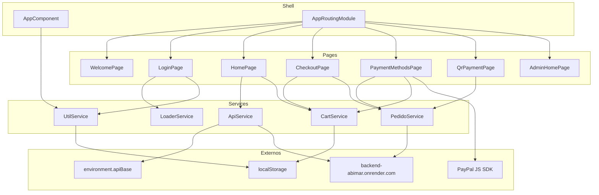

# Arquitectura

## Descripción

App Ionic con **páginas lazy-loaded** (un `NgModule` por página) y **servicios Angular** `providedIn: 'root'`.
No hay capas clean-architecture formales (`domain`/`data`/`presentation`). La responsabilidad se reparte entre Pages (UI + orquestación) y Services (HTTP / estado local).

## Responsabilidades por capa (intención)

| Capa | Vive en | Debe hacer | No debe hacer |
|---|---|---|---|
| Shell | `AppModule`, `AppComponent`, `AppRoutingModule` | bootstrap, menú, rutas raíz | lógica de negocio |
| Page | `src/app/<feature>/*.page.ts` | UI, validación de formulario, navegación, llamar services | hardcodear hosts (ideal); hoy varios lo hacen |
| Shared UI | `components/`, `LoaderService` | modales y feedback reutilizable | conocer endpoints |
| Application services | `CartService`, `UtilService`, `PedidoService`, `ApiService` | carrito, flags de UI, pedidos, HTTP genérico | renderizar vistas |
| Config | `environments/*` | `apiBase`, `production` | lógica |

## Dependencias permitidas

```
Page → Service → HttpClient / localStorage
Page → Router / Ionic Controllers
Service ↛ Page
```

`DataService` es un stub de catálogo estático de la plantilla original; el catálogo real usa `ApiService` + backend.

## Flujo principal de compra

1. `HomePage` / `CategoriaProductosPage` listan productos vía API.
2. `CartService.add` persiste en `localStorage` (`carrito`) y emite por `BehaviorSubject`.
3. `CheckoutPage.registrarPedido` crea pedido + detalles vía `PedidoService`, guarda `pedidoId`, navega a `payment-methods`.
4. PayPal o QR actualizan / verifican estado del pedido y van a `confirm`.

## Diagrama de intención arquitectónica



## Deuda conocida (afecta la arquitectura)

- Muchas Pages llaman URLs absolutas en lugar de `ApiService.url()` + `environment.apiBase`.
- `PedidoService` duplica el host en una constante propia (`private API`).
- Admin se decide por email hardcodeado en `LoginPage`, no por rol del backend.
- `DataService` coexiste con el catálogo real y puede confundir.

## Referencias

- [`network.md`](network.md)
- [`dependency_injection.md`](dependency_injection.md)
- [`navigation_state.md`](navigation_state.md)
- [`../modules/`](../modules/)
- [`../security/`](../security/)
